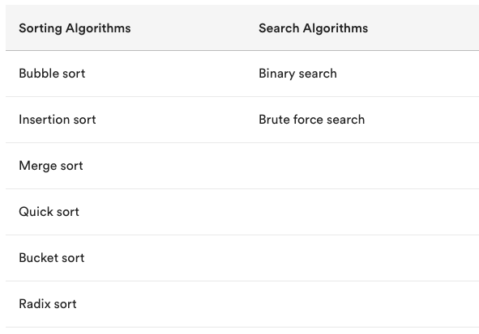
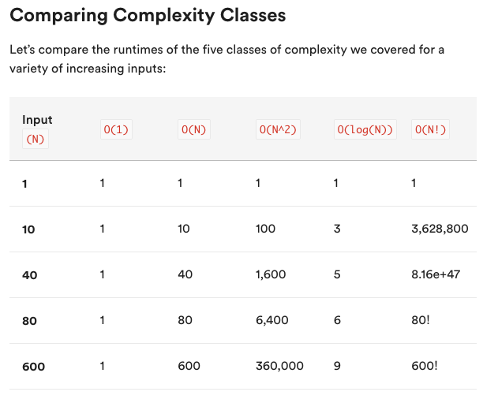
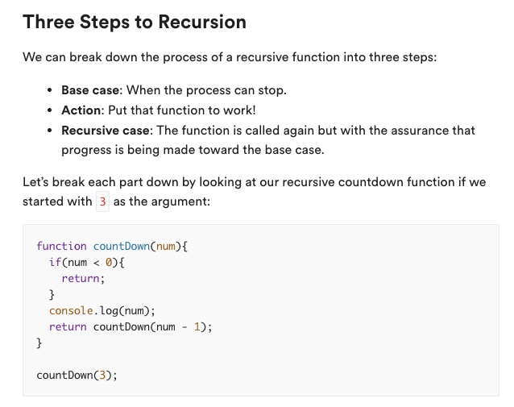

# SEIR_PostGrad_Labs
CS, Algorithms, Data Structures

## Algorithms

### Big O Complexity

Constant - O(1)
(Not necessarily the quickest)
Complexity does not change over time

Linear - O(N)
Complexity grows linearly with the amount of data

Quadratic - O(N^2)
e.g., nested for loops

Logarithmic - O(log(N))
Extremely efficient
    Imagine flipping through a phone book to find someone’s number. You could start at the beginning of the phone book and read every name on every page until it found the one you’re looking for. Sounds awful, right? That’s a linear O(N) algorithmic approach.

    Instead of reading every single name, it's much easier to read one random name and flip forward or backward depending on how close that name is to the name you’re looking for. This approach is a logarithmic O(log(N)) method. Much faster!

Exponential - O(2^N)
Inefficient

    If a recursive function calls itself twice in the recursive case, what type of time complexity would we get?

Factorial Complexity - O(N!)
Avoid at all cost!
    One example of an O(N!) algorithm is the “bogosort” — aka, the “slow sort.” Why so slow? An array is randomly ordered over and over again until it is correctly sorted. For an array with a length of 10, this sort may have to run up to 3,628,800 times!

### Recursion

see - recursion.js

When to use Recursion

    Recursion operates by breaking down a problem into smaller chunks. So, if you have a problem that can be broken down in this way, recursion is a natural fit.

    Use recursion in any situation that requires exploring multiple possibilities or paths, such as:

    Calculating all possible combinations of elements.
    Checking all possible routes between two destinations.
    Recursion provides the simplest solution to problems like these by allowing a function to continue through each possibility in a new recursive call.

    https://hackernoon.com/coding-interview-recursion-f0d60c9dbb60
    https://interviewing.io/recursion-interview-questions